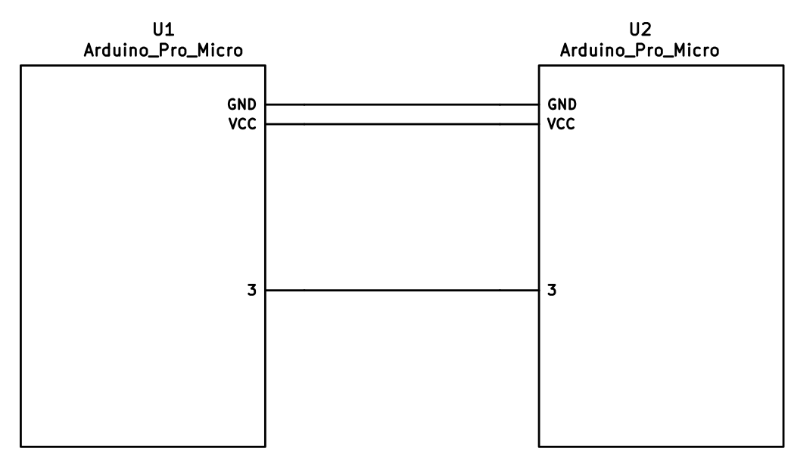
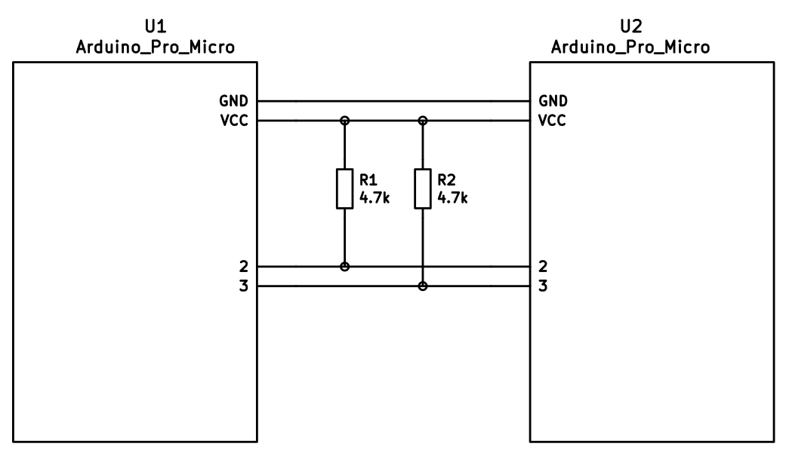

# Dactyl ManuForm

This is for the [Dactyl Manuform](https://github.com/tshort/dactyl-keyboard) keyboard, a fork of the [Dactyl](https://github.com/adereth/dactyl-keyboard) keyboard that incorporates the thumb cluster of the [ManuForm](https://github.com/jeffgran/ManuForm).

This code was adapted from the [Let's Split code](../lets_split).

Split keyboard firmware for Arduino Pro Micro or other ATmega32u4 based boards.


## Features

Some features supported by the firmware:

* Either half can connect to the computer via USB, or both halves can be used
  independently.
* You only need 3 wires to connect the two halves. Two for VCC and GND and one
  for serial communication.
* Optional support for I2C connection between the two halves if for some
  reason you require a faster connection between the two halves. Note this
  requires an extra wire between halves and pull-up resistors on the data lines.


## Required Hardware

Apart from diodes and key switches for the keyboard matrix in each half, you
will need:

* 2 Arduino Pro Micro's. You can find theses on aliexpress for ≈3.50USD each.
* 2 TRS sockets
* 1 TRS cable.

Alternatively, you can use any sort of cable and socket that has at least 3
wires. If you want to use I2C to communicate between halves, you will need a
cable with at least 4 wires and 2x 4.7kΩ pull-up resistors


## Optional Hardware

A speaker can be hooked-up to either side to the `5` (`C6`) pin and `GND`, and turned on via `AUDIO_ENABLE`. **This is not tested with the Dactyl-ManuForm.**


## Wiring

The 3 wires of the TRS cable need to connect GND, VCC, and digital pin 3 (i.e.
PD0 on the ATmega32u4) between the two Pro Micros.

Then wire your key matrix to any of the remaining 17 IO pins of the pro micro
and modify the `matrix.c` accordingly.

The wiring for serial:



The wiring for i2c:



The pull-up resistors may be placed on either half. It is also possible
to use 4 resistors and have the pull-ups in both halves, but this is
unnecessary in simple use cases.


## Notes on Software Configuration

Configuring the firmware is similar to any other QMK project. One thing
to note is that `MATIX_ROWS` in `config.h` is the total number of rows between
the two halves, i.e. if your split keyboard has 4 rows in each half, then
`MATRIX_ROWS=8`.

Also the current implementation assumes a maximum of 8 columns, but it would
not be very difficult to adapt it to support more if required.


## First Time Setup

 * Download or clone the whole repo.
 * [Setup](https://docs.qmk.fm/getting_started_build_tools.html) your dev env
 * install avrdude if you want to flash a firmware


## Build

To build all dactyl-manuform keymaps firmware

```
$ make dactyl_manuform
```

You will see a lot of output and if everything worked correctly, you will see the built hex files:

```
dactyl_manuform_rev1_4x5-default.hex
dactyl_manuform_rev1_4x5-fauxnesis.hex
dactyl_manuform_rev1_5x6-default.hex
dactyl_manuform_rev1_5x6-mrusu91.hex
```

If you would like to build a specific keymap, make sure it exist in `keyboards/dactyl_manuform/keymaps/`, and run:

```
$ make dactyl_manuform/rev1:YOUR-KEYMAP-NAME
```

If everything worked correctly you will see a file:

```
dactyl-manuform_rev1_YOUR-KEYMAP-NAME.hex
```


## Flashing

run:
```
$ make dactyl_manuform/rev1:KEYMAP-NAME:avrdude
```
Example: `make dactyl_manuform/rev1:4x5-default:avrdude`


## Cleaning

```
$ make dactyl_manuform:clean
```


## Custom keymaps

If you would like to create a custom keymaps, you can copy and adjust one of the existing [keymaps](keymaps/).

For more information on customizing keymaps, take a look at the primary documentation for [Customizing Your Keymap](https://docs.qmk.fm/#how-to-customize)


## Choosing which board to plug the USB cable into (choosing Master)

Because the two boards are identical, the firmware has logic to differentiate the left and right board.

It uses two strategies to figure things out: look at the EEPROM (memory on the chip) or looks if the current board has the usb cable.

The EEPROM approach requires additional setup (flashing the eeeprom) but allows you to swap the usb cable to either hand.

The USB cable approach is easier to setup.

The file that needs to be edited is `keyboards/dactyl-manuform/keymaps/KEYMAP-NAME/config.h`

### The USB cable approach

For left hand to be master:
```
#define MASTER_LEFT
// #define MASTER_RIGHT
// #define EE_HANDS
```
For right hand to be master:
```
// #define MASTER_LEFT
#define MASTER_RIGHT
// #define EE_HANDS
```


### The EEPROM approach

```
// #define MASTER_LEFT
// #define MASTER_RIGHT
#define EE_HANDS
```

You will also need to set the EEPROM for the left and right halves.

The EEPROM is used to store whether the half is left handed or right handed. This makes it so that the same firmware
file will run on both hands instead of having to flash left and right handed versions of the firmware to each half.

To flash the EEPROM file for the left half run:
```
avrdude -p atmega32u4 -P $(COM_PORT) -c avr109 -U eeprom:w:eeprom-lefthand.eep
// or the equivalent in dfu-programmer

```
and similarly for right half
```
avrdude -p atmega32u4 -P $(COM_PORT) -c avr109 -U eeprom:w:eeprom-righhand.eep
// or the equivalent in dfu-programmer
```

NOTE: replace `$(COM_PORT)` with the port of your device (e.g. `/dev/ttyACM0`)

After you have flashed the EEPROM, you then need to set `EE_HANDS` in your config.h, rebuild the hex files and reflash.

Note that you need to program both halves, but you have the option of using
different keymaps for each half. You could program the left half with a QWERTY
layout and the right half with a Colemak layout using bootmagic's default layout option.
Then if you connect the left half to a computer by USB the keyboard will use QWERTY and Colemak when the
right half is connected.


## Notes on Using Pro Micro 3.3V

Do update the `F_CPU` parameter in `rules.mk` to `8000000` which reflects
the frequency on the 3.3V board.

Also, if the slave board is producing weird characters in certain columns,
update the following line in `matrix.c` to the following:

```
// _delay_us(30);  // without this wait read unstable value.
_delay_us(300);  // without this wait read unstable value.
```


## udev rule

You may need to add custom udev rule so arduino device is mounted with correct permissions

Create `/etc/udev/rules.d/99-pro-micro.rules` with the following content:

```
ATTRS{idVendor}=="1b4f", ATTRS{idProduct}=="9205", MODE="0666", GROUP="plugdev", ENV{ID_MM_DEVICE_IGNORE}="1"
ATTRS{idVendor}=="1b4f", ATTRS{idProduct}=="9206", MODE="0666", GROUP="plugdev", ENV{ID_MM_DEVICE_IGNORE}="1"
ATTRS{idVendor}=="2341", ATTRS{idProduct}=="0036", MODE="0666", GROUP="plugdev"
```

Then re-load udev rules with `udevadm control --reload-rules` and re-plug your arduino
